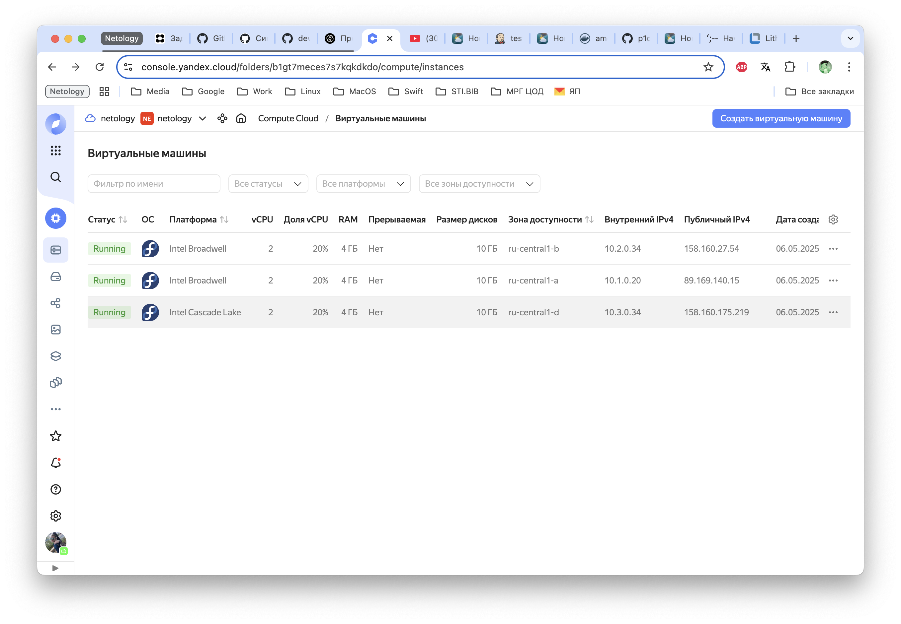
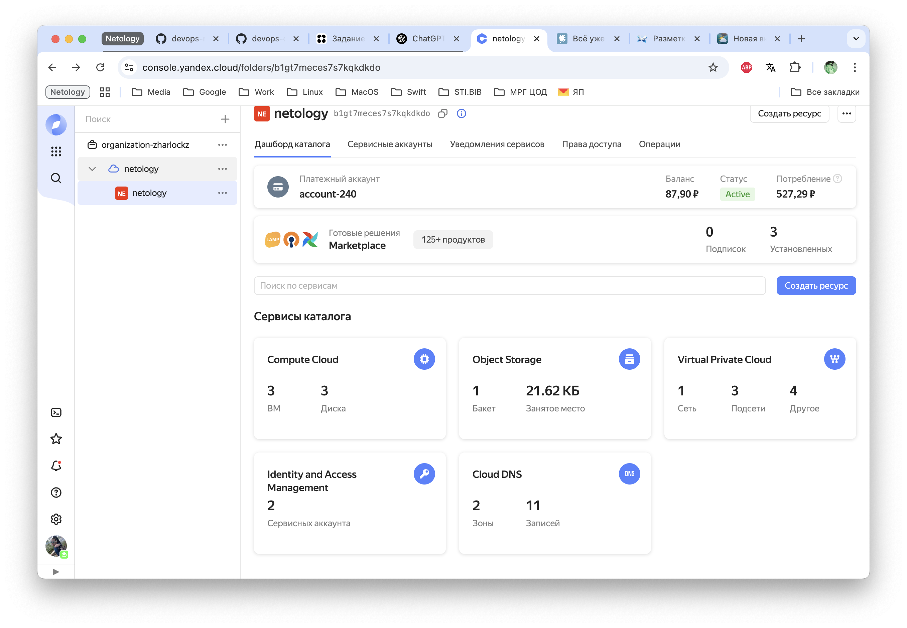

### Дипломная работа Netology

# Дипломный практикум в Yandex.Cloud
- [Дипломный практикум в Yandex.Cloud](#дипломный-практикум-в-yandexcloud)
    - [Облачная инфраструктура](#облачная-инфраструктура)
    - [Kubernetes кластер](#kubernetes-кластер)
    - [Тестовое приложение](#тестовое-приложение)
    - [Мониторинг](#мониторинг)
    - [Pipeline](#pipeline)

> [!IMPORTANT]
> 
>IP адреса далее могут отличатся, в связи с тем, что скриншоты отличаются по времени.

### Облачная инфраструктура

### Kubernetes кластер

### Тестовое приложение

### Мониторинг

### Pipeline

